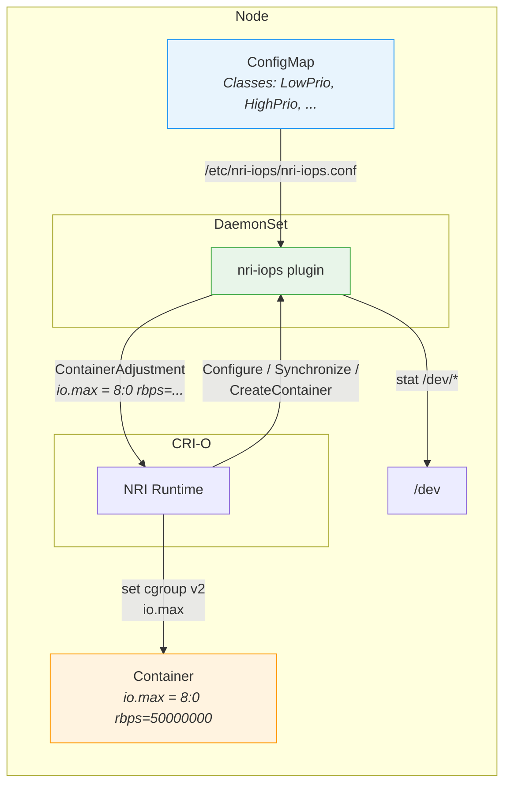
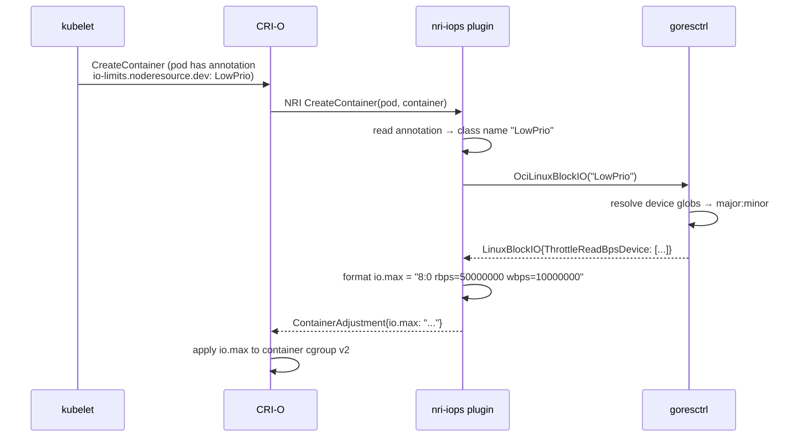

# nri-iops

An [NRI](https://github.com/containerd/nri) plugin for CRI-O that enforces block I/O rate limits (`io.max`) on containers using the cgroup v2 unified hierarchy.

IO classes are defined in a configuration file using the [goresctrl](https://github.com/intel/goresctrl) blockio format. Pods select a class by name via annotations.

## Design

### Architecture



### Flow



1. CRI-O receives a `CreateContainer` request for a pod with the `io-limits.noderesource.dev` annotation.
2. CRI-O calls the plugin via NRI with the pod and container metadata.
3. The plugin reads the annotation value (a class name like `LowPrio`).
4. goresctrl resolves the class to device throttle parameters, expanding device globs and symlinks to `major:minor` pairs.
5. The plugin returns a `ContainerAdjustment` that sets `io.max` in the cgroup v2 unified map.
6. On `Synchronize`, existing containers are updated the same way.

## Configuration

The plugin uses the [goresctrl blockio](https://github.com/intel/goresctrl/tree/main/pkg/blockio) config format to define IO classes:

```yaml
failOnInvalidAnnotation: true
logLevel: info

Classes:
  LowPrioThrottled:
    - Devices:
        - /dev/sd[a-z]
        - /dev/vd[a-z]
      ThrottleReadBps: 50M
      ThrottleWriteBps: 10M
      ThrottleReadIOPS: 10k
      ThrottleWriteIOPS: 5k

  HighPrioFullSpeed:
    - Devices:
        - /dev/sd[a-z]
      ThrottleReadBps: 500M
      ThrottleWriteBps: 200M
```

| Field | Description |
|-------|-------------|
| `Classes` | Map of class name to device parameters (goresctrl format) |
| `failOnInvalidAnnotation` | If `true`, reject container creation when the annotation references an unknown class. Default: `false` (log warning only) |
| `logLevel` | Log level: `debug`, `info`, `warn`, `error` |

### Device parameters

| Parameter | Description | Example |
|-----------|-------------|---------|
| `Devices` | List of device paths or globs | `/dev/sd[a-z]`, `/dev/disk/by-id/*SSD*` |
| `ThrottleReadBps` | Max read bytes/s | `50M`, `1G` |
| `ThrottleWriteBps` | Max write bytes/s | `10M` |
| `ThrottleReadIOPS` | Max read IO operations/s | `10k` |
| `ThrottleWriteIOPS` | Max write IO operations/s | `5k` |

Values use [Kubernetes resource quantity](https://kubernetes.io/docs/reference/kubernetes-api/common-definitions/quantity/) format (supports `k`, `M`, `G`, `Ki`, `Mi`, `Gi` suffixes).

## Pod annotations

Assign a class to all containers in a pod:

```yaml
annotations:
  io-limits.noderesource.dev: LowPrioThrottled
```

Assign different classes per container:

```yaml
annotations:
  io-limits.noderesource.dev/container.writer: LowPrioThrottled
  io-limits.noderesource.dev/container.reader: HighPrioFullSpeed
```

Container-scoped annotations override pod-scoped ones.

## Build

```sh
make build    # produces 90-nri-iops binary
make test     # runs unit and e2e tests
```

Container image:

```sh
podman build -t nri-iops -f Containerfile .
```

## Deployment

### Pre-installed plugin (binary on node)

```sh
make install
# Installs to /opt/nri/plugins/90-nri-iops
# Config to /etc/nri/conf.d/90-nri-iops.conf
```

CRI-O discovers and launches the plugin automatically. NRI is enabled by default in CRI-O.

### DaemonSet (external plugin)

```sh
kubectl apply -f examples/configmap.yaml
kubectl apply -f examples/daemonset.yaml
```

The DaemonSet mounts the NRI socket (`/var/run/nri/nri.sock`) and `/dev` (read-only) from the host. The plugin connects to CRI-O as an external NRI plugin.

See [`examples/`](examples/) for the full manifests.
